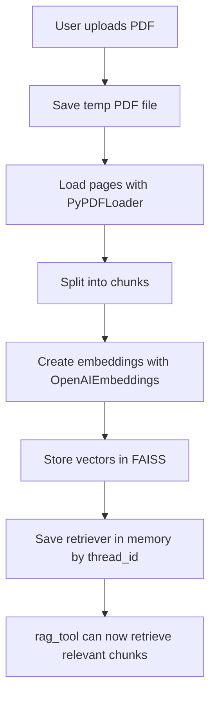
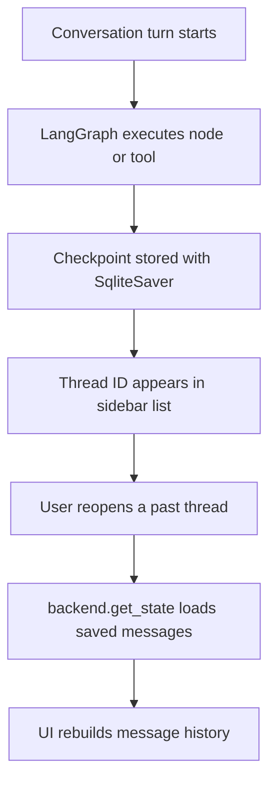

# Multi Utility Chatbot

A small Streamlit chatbot that combines a regular LLM chat experience with tool calling and PDF question answering.

The app uses LangGraph to manage the conversation loop, LangChain for model and tool integration, OpenAI for both chat and embeddings, and SQLite to persist chat checkpoints across conversations.
App Link:- https://v1-ops-multi-utility-ai-chatbot-app-dsmott.streamlit.app/

## What this project does

This chatbot supports:

- Multi-turn chat with separate conversation threads
- Persistent chat history using LangGraph checkpoints stored in SQLite
- Streaming assistant responses in the UI
- Tool calling for search, calculator, and weather
- PDF upload and retrieval-augmented question answering
- Per-thread document context, so each chat can have its own uploaded PDF
- A simple Streamlit interface with past conversation switching

## Features at a glance

### 1. Persistent conversations

Conversation state is stored through `SqliteSaver` in `chatbot.db`.

That means:

- Chat threads can be recovered from the checkpoint store
- Past conversations appear in the sidebar
- When you reopen a thread, the message history is loaded back into the UI

Important detail:

- Chat history is persisted in SQLite
- PDF retrievers are currently stored in memory, not in SQLite
- So after a full app restart, the chat thread can still exist, but the uploaded PDF index for that thread will need to be uploaded again

### 2. Streaming responses

The assistant response is streamed token-by-token into the Streamlit chat UI using `st.write_stream(...)`.

This makes the app feel more natural because the answer appears as it is generated rather than waiting for the full response to finish.

### 3. Tool calling

The model is bound to a small toolset and can decide when to use a tool.

Current tools:

- `DuckDuckGoSearchRun` for web search
- `calculator` for basic arithmetic
- `weather` for current weather lookup using `wttr.in`
- `rag_tool` for retrieving relevant chunks from the uploaded PDF

LangGraph routes the conversation automatically:

- If the model answers directly, the reply is returned
- If the model requests a tool, the tool node runs it
- The tool result is sent back to the model
- The model then produces the final answer

### 4. PDF RAG support

Each chat thread can have its own uploaded PDF.

When a PDF is uploaded:

- The file is temporarily saved
- `PyPDFLoader` reads the document
- `RecursiveCharacterTextSplitter` breaks it into chunks
- `OpenAIEmbeddings` creates embeddings
- `FAISS` stores the vectors
- A retriever is kept in memory for that thread

When the user asks about the document, the system prompt encourages the model to call `rag_tool` with the current `thread_id`.

### 5. Safer credential handling

OpenAI clients are initialized lazily instead of at import time.

This helps in two ways:

- The app fails more gracefully if `OPENAI_API_KEY` is missing
- Streamlit can show a clear error message instead of crashing immediately on startup

## Tech stack

- `Streamlit` for the frontend
- `LangGraph` for workflow orchestration and persistence checkpoints
- `LangChain` for message abstractions and tool integration
- `langchain-openai` for `ChatOpenAI` and `OpenAIEmbeddings`
- `FAISS` for vector storage
- `PyPDF` and `PyPDFLoader` for PDF ingestion
- `SQLite` for checkpoint persistence
- `python-dotenv` for loading environment variables

## Project structure

- `app.py` - Streamlit UI, thread handling, streaming display, sidebar actions
- `backend.py` - LangGraph workflow, tool binding, SQLite checkpointing
- `rag.py` - PDF ingestion, embeddings, FAISS retriever, RAG tool
- `tools.py` - search, calculator, and weather tools
- `prompts.py` - system prompt that guides tool use
- `config.py` - model names, PDF settings, and environment loading

## How the workflow works

### Chat workflow

```mermaid
flowchart TD
    A[User sends message in Streamlit] --> B[app.py builds LangGraph config with thread_id]
    B --> C[backend.stream()]
    C --> D[chat_node adds system prompt + user message]
    D --> E[ChatOpenAI decides next step]
    E -->|Direct answer| F[Stream response to UI]
    E -->|Tool call| G[ToolNode executes tool]
    G --> H[Tool result goes back to chat_node]
    H --> E
    F --> I[Checkpoint saved in SQLite]
```

### PDF ingestion workflow



### Thread persistence workflow



## What is being used under the hood

### Model

- Chat model: `gpt-4o-mini`
- Embedding model: `text-embedding-3-small`

These are configured in `config.py`.

### State and memory

There are two different kinds of state in this app:

1. Persistent state
   Stored in SQLite through LangGraph checkpoints.

2. Runtime-only state
   Stored in Python memory or Streamlit session state.

Runtime-only state includes:

- In-memory FAISS retrievers by `thread_id`
- Uploaded document metadata in `st.session_state`
- Thread titles in `st.session_state`

This split is worth knowing because it explains why chat history can survive a restart while the document index does not.

## Running the project

### 1. Install dependencies

```bash
pip install -r requirements.txt
```

### 2. Add your OpenAI API key

Create a `.env` file in the project root:

```env
OPENAI_API_KEY=your_api_key_here
```

### 3. Start the app

```bash
streamlit run app.py
```

## Example use cases

- Ask general questions and let the model respond normally
- Search the web when the assistant needs outside information
- Do quick calculations
- Check the weather for a city
- Upload a PDF and ask questions about its contents
- Maintain separate chats with different document contexts

## Current limitations

This project works well for a lightweight chatbot demo, but a few things are still intentionally simple:

- PDF vector stores are not persisted across restarts
- Thread titles are kept in Streamlit session state, so they are not fully durable
- Weather uses a simple external endpoint and has minimal normalization
- Search is basic and does not have a custom ranking layer
- There is no authentication or multi-user isolation

## Why the design feels simple

The codebase is intentionally straightforward.

Instead of hiding the workflow behind lots of abstraction, it keeps the moving parts easy to follow:

- Streamlit handles the UI
- LangGraph handles the conversation loop
- Tools are plain Python functions
- RAG is a focused per-thread feature, not a huge subsystem

That makes the project a good starting point if you want to learn how chat, tool calling, streaming, persistence, and document retrieval fit together in a real app.
